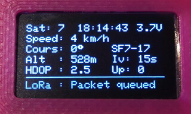

## Intro

 

* Working in 2024 with TTN V3.
* T-Beam 1.0 in 868MHZ (yes that's an old one).
* Only tested with Platformio in VScode.

This is a simple sketch demonstrating the capability of the [TTGO T-Beam](https://www.aliexpress.com/store/product/TTGO-T-Beam-ESP32-433-868-915Mhz-WiFi-wireless-Bluetooth-Module-ESP-32-GPS-NEO-6M/2090076_32875743018.html) as a [TTN Mapper](https://ttnmapper.org/) Node on [The Things Network](https://www.thethingsnetwork.org/) LoraWAN.

Forked from [MichaelEFlip/Lora-TTNMapper-T-Beam](https://github.com/MichaelEFlip/Lora-TTNMapper-T-Beam) from [sbiermann/Lora-TTNMapper-ESP32](https://github.com/sbiermann/Lora-TTNMapper-ESP32) and with some information/inspiration from [cyberman54/ESP32-Paxcounter](https://github.com/cyberman54/ESP32-Paxcounter) and [Edzelf/LoRa](https://github.com/Edzelf/LoRa).
The forked repo from hottimuc was converted to a PlatformIO project (currently for hardware revision >= 0.8).

## Features

* selectable datarate and power (button short press)
* selectable transmit interval (button longer press)
* selectable send-port to enable "on device" switch to experimental mapping (button even loooonger press)
* support for HW-revisions (V08 / V0.8, V09 / V0.9, V10 / V1.0, with soft-power-button and powermanagement chip) (short press = power-on / dimm-mode; long press = power-off)
* supports OLED display on the I²C interface on GPIO22 and GPI21. This repo contains a patched SSD1306 library from [smartnick](https://github.com/smartinick/Adafruit_SSD1306), enabling individual I²C pins and to set I²C Clock to 800kHz. 

 

## Software dependencies

[PlatformIO](https://platformio.org/)

[LMIC-Arduino](https://github.com/matthijskooijman/arduino-lmic) : Make sure to get the last version - *1.5.1*  (PlatformIO will take care of this)

## Instructions

Copy all from here locally, open it with PlatformIO, modify the config.h with your ABP credentials and upload.

On The Things Network side, the settings needed are available [here](https://www.thethingsnetwork.org/docs/applications/ttnmapper/).

Configuration in The Things Network Console:
- Frequency plan: Europe 863-870 MHz (SF9 for RX2 - recommended)  (9or where you are located!)
- LoRaWAN version: LoRaWAN Specification 1.0.2
- Regional Parameters version: RP001 Regional Parameters 1.0.2

Payload uplink formatter type: custom Javascript formatter
```javascript
function decodeUplink(input) {
	var bytes = input.bytes;
	var decoded = {};

	var latitude = ((bytes[0]<<16)>>>0) + ((bytes[1]<<8)>>>0) + bytes[2];
	latitude = (latitude / 16777215.0 * 180) - 90;

	var longitude = ((bytes[3]<<16)>>>0) + ((bytes[4]<<8)>>>0) + bytes[5];
	longitude = (longitude / 16777215.0 * 360) - 180;

	var altValue = ((bytes[6]<<8)>>>0) + bytes[7];
	var sign = bytes[6] & (1 << 7);
	var altitude;
	if(sign)
	{
		altitude = 0xFFFF0000 | altValue;
	}
	else
	{
		altitude = altValue;
	}

	var hdop = bytes[8] / 10.0;

  return {
    data: {
      latitude:latitude,
      longitude:longitude, 
      altitude:altitude, 
      hdop:hdop 
    },
    warnings: [],
    errors: []
  };
}
```
